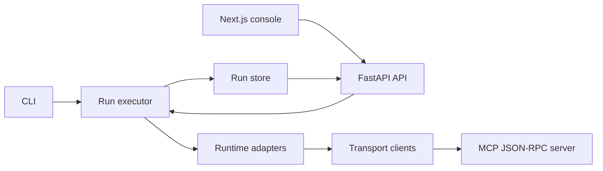

# usb-agents

usb-agents is a local MCP portability lab for comparing how agent runtimes behave against the
same tools, tasks, transports, approvals, traces, artifacts, and regression gates.

It is OSS-first: install the CLI, run deterministic suites locally, open the web console, and use
the outputs in CI before connecting real vendor credentials.

## What It Does

- Runs the same benchmark suite across runtime adapters and transport adapters.
- Exercises MCP-style tools over embedded, stdio, and HTTP JSON-RPC transports.
- Captures approvals, tool calls, traces, latency, failures, and generated artifacts.
- Serves run history through a local FastAPI API.
- Provides a Next.js console for matrix comparison, trace inspection, approval review, artifacts,
  and side-by-side artifact diffs.
- Ships deterministic visual and backend tests so UI and protocol regressions are visible.

## Quickstart

```bash
uv sync --all-extras
pnpm install

uv run usb-agents doctor
uv run usb-agents run --transport embedded
uv run usb-agents serve
```

In another terminal:

```bash
pnpm dev:web
```

Open [http://127.0.0.1:3000](http://127.0.0.1:3000).

## Core Commands

```bash
uv run usb-agents init
uv run usb-agents doctor
uv run usb-agents run --transport embedded
uv run usb-agents run --transport embedded --transport http --transport stdio
uv run usb-agents serve --port 8765
uv run usb-agents report
uv run usb-agents compare
uv run usb-agents conformance
uv run usb-agents sdk-smoke
uv run usb-agents golden-demo
```

Legacy scripts are still available when you need CSV/Markdown exports outside the run store:

```bash
uv run python scripts/run_matrix.py --transports embedded http stdio --fail-on-alert
uv run python scripts/report.py results.csv
uv run python scripts/trace_summary.py traces
```

## Architecture



Key modules:

- `src/usb_agents/run_executor.py`: shared orchestration for CLI and API-triggered runs.
- `src/usb_agents/run_store.py`: run manifests, artifact indexing, and artifact resolution.
- `src/usb_agents_mcp/server.py`: stdio and HTTP JSON-RPC MCP tool surface.
- `src/usb_agents_api/app.py`: local API for runs, event streams, artifacts, suites, and adapters.
- `apps/web`: local product console.

## Repository Structure

```text
.
├── apps/web/              # Next.js local console and Playwright visual suite
├── docs/                  # Architecture, protocol, security, release, and verification docs
├── examples/              # Small reference fixtures for MCP and adapter authors
├── mcp-server/            # Compatibility wrapper and default approval policy
├── scripts/               # Legacy report/dashboard helpers
├── src/                   # Installable Python packages
├── tasks/                 # Immutable deterministic benchmark fixtures
├── tests/                 # Python protocol, API, runner, security, and metrics tests
├── PRODUCT.md             # Product direction
├── DESIGN.md              # Frontend design system
└── usb-agents.yaml        # Local suite/runtime/transport config
```

Generated runs, traces, screenshots, build outputs, and local dependency directories are ignored.
Use `uv run usb-agents golden-demo` to create a fresh curated demo under `.usb-agents/runs/`.

## Run Artifacts

Generated outputs are written under `.usb-agents/runs/<timestamp>/`:

```text
.usb-agents/runs/<timestamp>/
  run.json
  traces/*.ndjson
  artifacts/*.csv
```

Tracked task fixtures are treated as immutable. Benchmark tasks must not write generated outputs
back into `tasks/`.

## Verification

```bash
pnpm verify
```

or run the gates individually:

```bash
uv run ruff check .
uv run mypy .
uv run pytest -q
pnpm lint
pnpm --filter @usb-agents/web build
pnpm verify:visual
pnpm verify:conformance
pnpm verify:release
```

`pnpm verify:visual` runs desktop and mobile Playwright checks with deterministic screenshots,
geometry assertions, reduced-motion coverage, and no-overflow checks.

## MCP Surface

The local server supports:

- `initialize`
- `tools/list`
- `tools/call`
- `resources/list`
- `resources/read`
- `prompts/list`
- `prompts/get`

Start it manually:

```bash
uv run python -m mcp_server.server --transport http --host 127.0.0.1 --port 8000
uv run python -m mcp_server.server --transport stdio
```

External conformance smoke:

```bash
uv run usb-agents conformance
```

This launches the local MCP server and runs the official `@modelcontextprotocol/conformance`
server scenarios for initialize, tools list, resources list, and prompts list.

## Runtime Adapters

The current runtime adapters are deterministic simulator-backed seams:

- OpenAI Agents
- Microsoft Agent Framework
- Mistral Agents

This is intentional for local tests. SDK readiness is explicit:

```bash
uv run usb-agents sdk-smoke
uv run usb-agents sdk-smoke --runtime openai_agents --require
```

`--require` fails when the relevant credential environment variable is absent.

## Documentation

- [Product](PRODUCT.md)
- [Design system](DESIGN.md)
- [Architecture](docs/architecture.md)
- [Security threat model](docs/security-threat-model.md)
- [Visual verification protocol](docs/visual-verification-protocol.md)
- [Burn-down](.codex/BURNDOWN.md)

## Quality Bar

Before opening a pull request, run:

```bash
uv sync --all-extras
uv run ruff check .
uv run mypy .
uv run pytest -q
uv build
pnpm install
pnpm lint
pnpm --filter @usb-agents/web build
pnpm verify:visual
pnpm verify:conformance
uv run usb-agents run --transport embedded
```

See [CONTRIBUTING.md](CONTRIBUTING.md) for maintainer workflow and release expectations.
