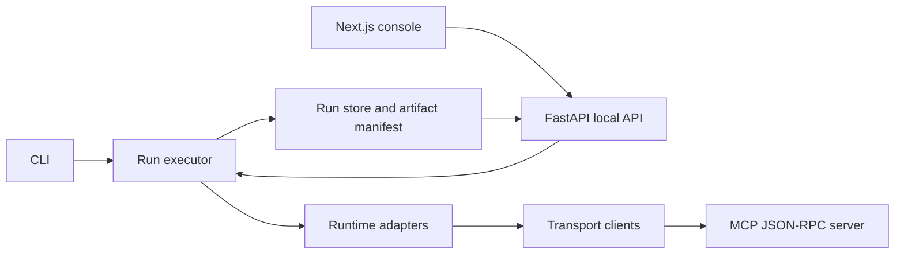

# Architecture

usb-agents is organized around one deep orchestration module: a run executes a task suite across
runtime adapters and transport adapters, then writes a manifest that the CLI, API, and web console
can all consume.

## Modules

- `usb_agents.run_executor`: orchestrates run creation and owns process lifecycle for local HTTP
  transport runs.
- `usb_agents.run_store`: persists and resolves run manifests, trace files, and generated artifacts.
- `usb_agents_mcp.server`: exposes the local benchmark tools over stdio and HTTP JSON-RPC.
- `usb_agents_api.app`: serves run history, run creation, event streams, and artifact retrieval.
- `apps/web`: renders the local product console.

## Current Limits

- Runtime adapters are simulator-backed seams. Real vendor adapters need credentialed integration
  tests before they should be called production-grade.
- HTTP currently implements the local JSON-RPC surface and protocol headers, but not a complete
  production Streamable HTTP session lifecycle.
